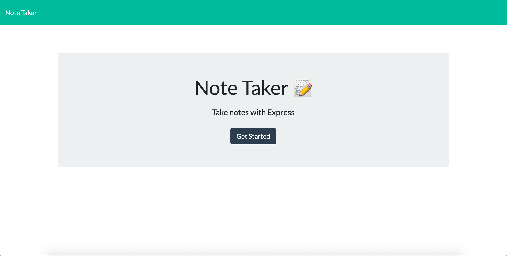

# Note-Taker

Welcome to my Note Taker Application! This application will allow you to write, save, and delete notes in one place. This application uses an express backend. This application is great for users that are looking to organize their thoughts and keep track of tasks they need to complete. 

## Usage 
This application can be used in the browser by visiting it via Heroku via this link: https://note-taker-ja.herokuapp.com/

Once you visit the application, you will be greeted with this landing page, click get started to get started! 

Add your notes here, and click the save button to save. If you want to delete a note, click the trash icon for the corresponding note and it will be deleted. 

## License 
MIT

## Acknowledgements 
I would like to acknowledge Sami Sully for working through some of this code with me - having her to bounce ideas off of was great! 

## Contributing
If interested in contributing, please reach out to me directly via an email at jada.arnett@gmail.com. 

